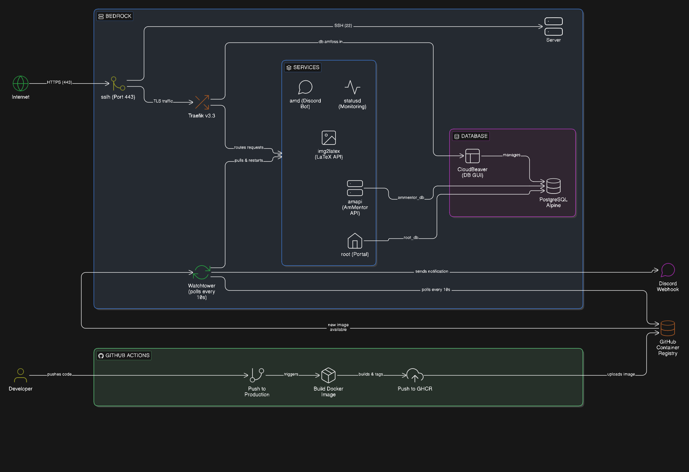

# Bedrock

Bedrock is the core infrastructure repository for [amFOSS](https://amfoss.in) (Amrita Free and Open Source Software). It contains Docker Compose configurations, reverse proxy setup, database configurations, and deployment automation for all amFOSS services.

## Architecture Overview



## Services

| Service | Image | Description | URL |
|---------|-------|-------------|-----|
| **root** | `ghcr.io/amfoss/root` | Main amFOSS portal/application | `root.amfoss.in` |
| **amapi** | `ghcr.io/amfoss/ammentor-backend` | AmMentor backend API | `amapi.amfoss.in` |
| **img2latex** | `ghcr.io/amfoss/img2latex` | Image to LaTeX conversion API | `latex-api.amfoss.in` |
| **cloudbeaver** | `dbeaver/cloudbeaver` | Web-based database management GUI | `db.amfoss.in` |
| **traefik** | `traefik:v3.3` | Reverse proxy with automatic service discovery | `traefik.amfoss.in` |
| **sslh** | `ghcr.io/yrutschle/sslh` | Protocol multiplexer for port 443 - routes TLS to Traefik and SSH to host | - |
| **watchtower** | `beatkind/watchtower` | Automatic container updates | - |
| **amd** | `ghcr.io/amfoss/amd` | amFOSS Discord bot | - |
| **statusd** | `ghcr.io/amfoss/statusd` | Status monitoring service | - |
| **postgres** | `postgres:alpine` | PostgreSQL database | - |

## CI/CD Pipeline

### Deployment Flow

1. **Code Push**: A developer pushes code to the `production` branch of a tracked project (e.g., `amfoss/root`, `amfoss/amd`)
2. **GitHub Actions**: Automatically builds a Docker image and pushes it to GitHub Container Registry (`ghcr.io/amfoss/*`)
3. **Watchtower**: Polls the registry every 10 seconds for new images
4. **Auto-Update**: When a new image is detected, Watchtower pulls it and restarts the container
5. **Notification**: A Discord notification is sent via webhook upon successful update

```
Developer Push --> GitHub Actions --> GHCR --> Watchtower --> Container Restart
     |                                                              |
     +-------------------------> Discord Notification <-------------+
```

## Prerequisites

- Docker and Docker Compose
- SSL certificates (Cloudflare Origin Certificates)
- Access to amFOSS GitHub Container Registry
- A server with port 443 available

## Setup

### 1. Clone the Repository

```bash
git clone https://github.com/amfoss/bedrock.git
cd bedrock
```

### 2. Configure Environment Variables

```bash
cp .env.sample .env
```

Edit `.env` and fill in the required values:

| Variable | Description | Required |
|----------|-------------|----------|
| `POSTGRES_USER` | PostgreSQL username | Yes |
| `POSTGRES_PASSWORD` | PostgreSQL password | Yes |
| `ROOT_SECRET` | Secret key for Root application | Yes |
| `DISCORD_TOKEN` | Discord bot token for amD | Yes |
| `HOSTNAME` | Base domain (e.g., `amfoss.in`) | Yes |
| `DC_WEBHOOK_TOKEN` | Discord webhook token for notifications | Yes |
| `DC_WEBHOOK_ID` | Discord webhook ID for notifications | Yes |
| `SMTP_EMAIL` | SMTP email for AmMentor | For email features |
| `SMTP_PASSWORD` | SMTP password | For email features |

### 3. Set Up SSL Certificates

Place Cloudflare Origin Certificates in the following location on the host:

```
/etc/ssl/amfoss.in/
├── cert.pem
└── key.pem
```

### 4. Create Traefik Authentication File

Create a directory for secrets and generate the htpasswd file:

```bash
mkdir -p secrets
# Using htpasswd (install via apache2-utils)
htpasswd -c secrets/traefik-htpasswd <username>
```

### 5. Start Services

```bash
docker compose up -d
```

### 6. Verify Deployment

```bash
# Check all containers are running
docker compose ps

# View logs
docker compose logs -f

# Check specific service
docker compose logs -f root
```

## Configuration Files

| File | Purpose |
|------|---------|
| `docker-compose.yml` | Main service orchestration |
| `traefik.yml` | Traefik static configuration |
| `certs-traefik.yml` | TLS certificate configuration (dynamic) |
| `postgresql.conf` | PostgreSQL server configuration |
| `create_databases.sql` | Database initialization script |
| `.env` | Environment variables (not in git) |

## Networking

### Port Usage

| Port | Service | Protocol |
|------|---------|----------|
| 443 | sslh | TLS/SSH multiplexer |
| 22 (host) | SSH | Forwarded from sslh |

### Internal Ports (Not Exposed)

| Port | Service |
|------|---------|
| 3000 | root |
| 8000 | amapi |
| 5000 | img2latex |
| 5432 | postgres |

### DNS Configuration

Ensure the following DNS records point to your server:

- `traefik.amfoss.in` - Traefik dashboard
- `root.amfoss.in` - Root application
- `amapi.amfoss.in` - AmMentor API
- `latex-api.amfoss.in` - Image to LaTeX API
- `db.amfoss.in` - CloudBeaver database GUI

## Database

PostgreSQL is automatically initialized with two databases:
- `root_db` - Used by the Root application
- `ammentor_db` - Used by AmMentor

### Accessing the Database

**Via CloudBeaver (Web UI):**
Navigate to `https://db.amfoss.in`

**Via CLI:**
```bash
docker compose exec postgres psql -U <POSTGRES_USER> -d root_db
```

## Watchtower Configuration

Watchtower is configured to:
- Poll for updates every **10 seconds**
- Send notifications to Discord on updates
- Clean up old images after updates
- Skip startup notifications

Services excluded from auto-updates (via label `com.centurylinklabs.watchtower.enable=false`):
- `postgres` - To prevent unexpected database restarts
- `cloudbeaver` - To maintain stable DB GUI access

## Operations

### Viewing Logs

```bash
# All services
docker compose logs -f

# Specific service
docker compose logs -f <service-name>

# Last 100 lines
docker compose logs --tail 100 <service-name>
```

### Restarting Services

```bash
# Single service
docker compose restart <service-name>

# All services
docker compose restart
```

### Updating Configuration

After modifying configuration files:

```bash
# Recreate affected containers
docker compose up -d

# Force recreate specific service
docker compose up -d --force-recreate <service-name>
```

### Manual Image Update

```bash
# Pull latest images
docker compose pull

# Recreate containers with new images
docker compose up -d
```

### Database Backup

```bash
# Backup all databases
docker compose exec postgres pg_dumpall -U <POSTGRES_USER> > backup.sql

# Backup specific database
docker compose exec postgres pg_dump -U <POSTGRES_USER> root_db > root_db_backup.sql
```

### Database Restore

```bash
# Restore from backup
cat backup.sql | docker compose exec -T postgres psql -U <POSTGRES_USER>
```

## Security Notes

- The `.env` file contains sensitive credentials and should never be committed
- The `secrets/` directory contains authentication files and should be protected
- Traefik dashboard is protected with basic authentication
- All external traffic is TLS-encrypted via Cloudflare Origin Certificates
- Database is not exposed externally; access is through CloudBeaver or internal network only

## Contributing

1. Make changes to configuration files
2. Test locally if possible
3. Create a pull request with a clear description of changes
